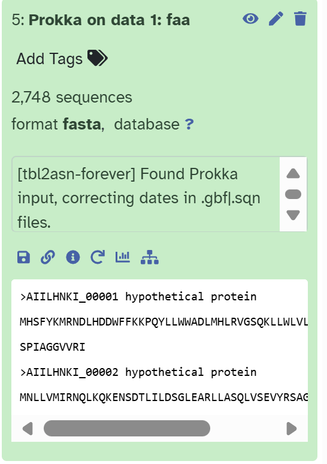
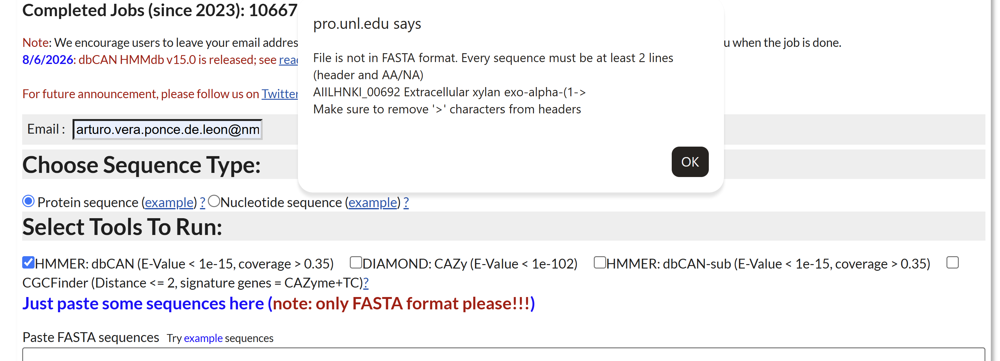
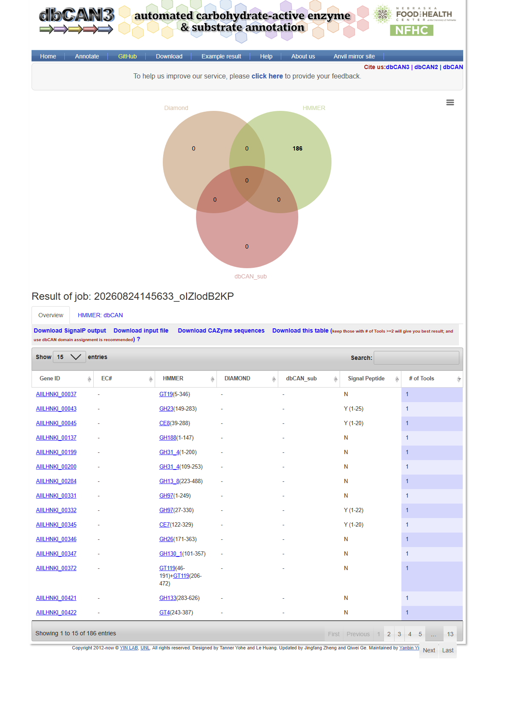

<a href="{{ site.baseurl }}/" title="Home">🏠 Home</a>

# HFX307/407 Metagenomic Computer Lab

## Exercise A – Genome annotation in bacteria and archaea – genomes and MAGs

[Prokka](https://github.com/tseemann/prokka) is a rapid genome annotation pipeline designed for bacterial and archaeal genomes. It identifies genomic features such as protein-coding sequences (CDSs), rRNAs and tRNAs, and assigns putative functions to predicted genes by comparing them against reference databases. Prokka can also be applied to metagenome-assembled genomes (MAGs), producing standard output files containing gene coordinates, nucleotide sequences and predicted protein sequences.

In this exercise, Prokka will be used to annotate the MAG and generate the predicted protein sequences that will be used for downstream functional analyses.


1. The first we need a fasta file, let's download the file from [here](https://ns9864k.web.sigma2.no/TheMEMOLab/courses/hfx307_407/Genome/)
    - Do click on the ```Control_HighE.metabat.733.fa``` file an save link as. Save it to your PC.

2. We can use Galaxy, a web-based platform for data intensive life science research that provides users with a unified, easy-to-use graphical interface to a host of different analysis tools to launch Prokka and 
annotate our genome. Let's login to [Galaxy](https://usegalaxy.no/) using our Feide credentials. 

3. Upload the fasta file using the ```upload``` buttom as it is shown here 

4. Once uploaded you shoudl see it in your history: 


5. To launch Prokka we can look for it in the Tools search . 

6. Select the ```Control_HighE.metabat.733.fa``` file and press ```run Tool```. Jobs are submitted now:


Once completed all jobs will appear as green: 


Prokka producces different files:

| File | Contains |
|---|---|
| `.gff` | Genome annotation in GFF3 format, including the coordinates and annotation of predicted genes, CDSs, rRNAs, tRNAs and other features. |
| `.gbk` | GenBank-formatted annotated genome containing the DNA sequence together with all predicted genomic features and annotations. |
| `.faa` | Amino-acid sequences of all predicted protein-coding genes. This is the main file used for downstream protein-function analyses. |
| `.ffn` | Nucleotide sequences of all predicted genes and other annotated features. |
| `.fna` | Nucleotide sequence of the input contigs/genome. |
| `.tbl` | Feature table containing the locations and annotations of genomic features, mainly used for submission to sequence databases. |
| `.sqn` | Sequin-formatted file prepared for submission to GenBank/ENA-type repositories. |
| `.txt` | Short summary of the annotation, including the number of contigs, CDSs, rRNAs, tRNAs and other predicted features. |
| `.log` | Log file recording the Prokka run, parameters and processing steps. |

We can then use the .tbl file to extract the annotation. To save open the ```10. Prokka on data 1: tsv``` file and click on the disk button:


## Using Copilot to summarize the information of the Prokka annotation.

Use your NMBU account to login into [Microsoft-Copilot](https://copilot.com/). 

1. Upload the tsv file using the ```+``` button.

2. Once your file is up, lets use this prompt:

### 🤖 Copilot prompt

```copilot
Hi, use the annotation table attached from prokka. Let me know how many genes are from metabolism, anabolism and how many non-annotated or non known function genes are. Give me a table with this summary
```

What is the result?

3. We can check for CAZy genes by prompting:

### 🤖 Copilot prompt

```copilot
Check for carbohydrate active genes (CAZymes), give a summary table
```

4. Produce a plot with this information:

### 🤖 Copilot prompt

```copilot
using this information produce 2 barplots a) general summary and b) Barplot for CAZy genes. Display the plots here and also give me the links to download them as png files.
```


### What other idea do you think we can look using this tools?


Unfortunatelly Prokka is not a specific tool for CAZy discovery. Let's use a specific tool for CAZy Discovery dbCAN. 


## Excersice B Predicting CAZyme function using CAZyDB

1. Get the the amino acid annotated file from Galaxy: ```Prokka on data 1 faa```




2. Go to blast in [dbCAN](https://pro.unl.edu/dbCAN2/blast.php)


3. Use your institutional email and submit the file. Is something wrong?

.

The fasta file is not suitable. So let's ask Copilot to modify this for us.

4. In Copilot upload the fasta file you got from ```Prokka on data 1 faa``` and then use this prompt:

### 🤖 Copilot prompt

```copilot
I have a protein FASTA file generated by Prokka. dbCAN reports a formatting problem because some FASTA headers contain extra ">" characters.

Please clean the FASTA file so that:
1. Each sequence header contains only the gene ID.
2. Each header starts with exactly one ">" character.
3. Do not modify, remove, or reorder any protein sequences.
4. Keep all sequences in FASTA format.

After cleaning the file, produce a downloadable FASTA file that I can use as input for dbCAN.  Before creating the file, briefly explain what was wrong with the original FASTA headers.
```


5. Download the file and use it in dbCAN. Submit the job.

6. After some minutes a link to your results will be sent to your email:




### Use Copilot to extract and summarize dbCAN and Prokka results.

With this experiment now we can use Copilot to gather our results together. 

1. Let's summaryze and get biological meaning of the dbCAN results. Download the dbCAN table.

2. Upload to Copilot and use the following prompt:

### 🤖 Copilot prompt

```Copilot
This table contains results from the dbCAN server for a bacterial genome.

Please:

1. Summarize the main CAZyme families identified, including GH, GT, CE, PL, AA and CBM families when present.
2. Identify which CAZyme families are most abundant.
3. Explain the general biological roles associated with the main families.
4. Based on these results, suggest what types of carbohydrates this organism may be able to degrade, modify or synthesize.
5. Clearly distinguish between conclusions directly supported by the dbCAN results and biological hypotheses that would require further validation.
6. Do not assign a specific substrate or enzyme function when the CAZyme family alone is not sufficient to support that conclusion.

Finish with a short biological interpretation of what these CAZyme profiles might suggest about the ecological or metabolic role of the organism.
```


### Which conclusions in your interpretation are strongest, and which are the most uncertain?

## Generate a common biological interpretation using both Prokka and DBCAN.

Let's use Copilot to summarize both Prokka and dbCAN results.

### 🤖 Copilot prompt

```Copilot
Using the attached Prokka results and the dbCAN overview table, generate 4 bar plots and a short interpretation.

Please create:

1. A general annotation summary plot from the Prokka results, showing the counts of major annotated feature types (for example: CDS, tRNA, rRNA, tmRNA, ncRNA, repeat regions, and hypothetical proteins if available).
2. A putative CAZyme discovery plot based on the Prokka annotations, showing the number of genes that appear to be related to CAZyme functions. Clearly label this plot as inferred from Prokka annotations.
3. A CAZyme discovery plot based on the dbCAN overview, showing the number of genes in each CAZy class (GH, GT, CE, PL, AA, CBM) and/or the most abundant CAZy families.
4. A plot showing the percentage of CAZyme genes predicted to be involved in the metabolism of particular polysaccharides (for example cellulose, hemicellulose, starch, pectin, chitin, or other relevant categories).

Please also:
- Use only the information present in the attached files.
- Do not invent annotations or metabolic roles that are not supported by the data.
- Clearly explain any assumptions used to assign CAZyme genes to polysaccharide categories.
- Distinguish between results directly supported by dbCAN and interpretations inferred from Prokka.
- If any plot cannot be produced from the attached files, explain what information is missing instead of guessing.

Finish with a short biological interpretation of the main results.
```

If everything work we can create a final HTML document

## Creating a nice HTML report.

In a new Copilot chat, upload both the Prokka and DBCAN tables and then use this prompt:


### 🤖 Copilot prompt

```Copilot
# Copilot Prompt: Generate a Self-Contained Prokka + dbCAN Biological Annotation Report

Using the attached **Prokka annotation results** and **dbCAN overview table**, generate a complete scientific report that summarizes and biologically interprets the genome annotation and carbohydrate-active enzyme annotation.

The report must not only show counts and plots. It must explain what the annotation suggests biologically, while clearly distinguishing direct evidence from interpretation and uncertainty.

Create both:

1. `annotation_report.html`
2. `annotation_report.md`

The HTML report must be a **single fully self-contained file** that displays all tables, figures, text, captions, and interpretations correctly when opened directly in a web browser.

---

# 1. General analysis rules

Use only information contained in the attached Prokka and dbCAN files as primary evidence.

Do not invent:

- genes
- proteins
- CAZy families
- enzyme functions
- pathway assignments
- substrate specificity
- metabolic capabilities
- ecological functions
- gene counts

If information cannot be determined reliably from the input files, explicitly state:

**This analysis cannot be completed reliably from the provided files.**

Do not guess.

Preserve gene identifiers exactly as provided in the source files.

Do not silently remove, rename, merge, or reorder genes.

---

# 2. Dataset overview

Start with a short description of the input data.

Report, when available:

- number of contigs
- total genome size
- number of CDSs
- number of hypothetical proteins
- number of proteins with functional annotation
- rRNAs
- tRNAs
- tmRNAs
- ncRNAs
- repeat regions
- other relevant Prokka feature types

Present these results in a compact summary table.

After the table, provide a short biological interpretation describing what the annotation profile suggests about the genome.

For example, discuss whether a large fraction of proteins remain hypothetical and what that means for confidence in downstream functional interpretation.

---

# 3. Prokka annotation summary

Create a bar plot summarizing the main genomic annotation categories identified by Prokka.

Where available, include:

- CDS
- hypothetical proteins
- functionally annotated proteins
- rRNA
- tRNA
- tmRNA
- ncRNA
- repeat regions
- other relevant annotation categories

Explain clearly how each category was calculated.

Do not treat Prokka predictions as experimentally confirmed functions.

## Biological interpretation

Immediately below the figure, interpret the result.

Discuss, where supported:

- proportion of predicted proteins with functional annotation
- proportion of hypothetical proteins
- whether the genome appears well characterized or poorly characterized
- any notable abundance of particular annotation categories

---

# 4. Putative carbohydrate-related functions from Prokka

Search the Prokka annotations for genes potentially associated with carbohydrate metabolism.

Possible terms may include:

- glycoside hydrolases
- glycosyltransferases
- carbohydrate esterases
- polysaccharide lyases
- carbohydrate-binding proteins
- carbohydrate transport
- sugar transport
- carbohydrate utilization
- polysaccharide degradation
- carbohydrate biosynthesis

Create a bar plot summarizing the main putative carbohydrate-related functional categories.

Clearly label this analysis as:

**Putative carbohydrate-related functions inferred from Prokka annotations**

Do not treat Prokka carbohydrate annotations as equivalent to dedicated CAZyme annotation.

Do not assign CAZy families unless those families are explicitly present in the Prokka annotation.

## Biological interpretation

Explain what these Prokka annotations may suggest about carbohydrate metabolism.

Discuss:

- degradation-related functions
- transport-related functions
- biosynthetic functions
- whether carbohydrate-associated functions appear diverse or limited

Clearly distinguish direct annotation from biological inference.

---

# 5. dbCAN CAZyme annotation

Using the dbCAN overview table, summarize the carbohydrate-active enzymes identified.

Report the number of genes assigned to the major CAZy classes:

- GH — Glycoside Hydrolases
- GT — GlycosylTransferases
- CE — Carbohydrate Esterases
- PL — Polysaccharide Lyases
- AA — Auxiliary Activities
- CBM — Carbohydrate-Binding Modules

Create a bar plot showing the number of genes in each CAZy class.

Also create a properly formatted summary table containing, when available:

- CAZy family
- CAZy class
- number of genes
- general biological role
- supporting annotation

Do not report raw Python objects.

For example, do not display:

`{'GT': 26, 'GH': 141, 'CE': 25}`

Instead, convert these values into a proper HTML table, Markdown table, or figure.

## Biological interpretation

Interpret the overall CAZyme profile.

Discuss, where supported:

- whether GHs dominate
- whether GTs are abundant
- contribution of CE, PL, AA, and CBM classes
- whether the profile appears more strongly associated with carbohydrate degradation, modification, binding, or biosynthesis

Do not infer specific substrates based only on CAZy class membership.

---

# 6. Most abundant CAZy families

Identify the most abundant CAZy families in the dbCAN results.

Create a ranked bar plot showing the 10–20 most abundant families.

If fewer than 10 families are present, show all families.

Sort from most abundant to least abundant.

Create a table containing:

- CAZy family
- CAZy class
- number of genes
- general functional role, when supported

## Biological interpretation

Interpret the most abundant families.

Discuss:

- whether the dominant families are primarily associated with degradation, modification, binding, or biosynthesis
- whether several abundant families appear to participate in related biological processes
- whether particular CAZyme groups appear unusually prominent

Avoid assigning exact substrates when family-level evidence is insufficient.

---

# 7. Predicted polysaccharide utilization

Using the dbCAN annotation, identify genes or CAZy families that may be associated with metabolism of major polysaccharide groups.

Where supported by the available annotation, consider:

- cellulose
- hemicellulose
- xylan
- arabinoxylan
- starch
- glycogen
- pectin
- chitin
- beta-glucans
- mannans
- fructans
- host-derived glycans
- other relevant polysaccharides

Create a bar plot showing either:

- percentage of CAZyme genes associated with each substrate category

or, if percentages are not meaningful:

- number of genes associated with each substrate category

Clearly state which denominator is used.

For every substrate assignment:

- explain how the CAZy family was associated with the substrate
- distinguish direct annotation from inference
- allow genes to occur in more than one category when biologically appropriate
- state clearly if percentages therefore do not sum to 100%

Do not assign a substrate when CAZy family membership alone does not support it.

## Biological interpretation

Discuss:

- which polysaccharide categories have the strongest genomic support
- whether the CAZyme repertoire suggests broad utilization or specialization
- whether several complementary CAZyme families support the same substrate category
- which predictions are strongest and which remain uncertain

Use cautious wording such as:

> The CAZyme repertoire suggests potential capacity for...

rather than:

> This organism degrades...

unless the evidence is sufficiently strong.

---

# 8. Comparison between Prokka and dbCAN

Compare carbohydrate-related information obtained from Prokka and dbCAN.

Explain:

- what Prokka detects
- what dbCAN detects
- why the two tools may identify different numbers of carbohydrate-related genes
- why dbCAN provides more specialized CAZyme annotation
- where results agree
- where they differ

If gene identifiers can be matched reliably, identify genes supported by both approaches.

Do not force matches when identifiers cannot be connected reliably.

Create a comparison table when possible.

## Biological interpretation

Explain what additional biological understanding is gained by combining Prokka and dbCAN.

---

# 9. Integrated biological interpretation

This section is mandatory and must be substantial.

Do not simply repeat the figures or gene counts.

Synthesize the results into a biological interpretation of the genome.

Discuss:

## General functional potential

- What broad functional patterns are visible?
- How much of the genome has interpretable functional annotation?
- Are many proteins still hypothetical?

## Carbohydrate metabolism

- How prominent does carbohydrate metabolism appear to be?
- Which CAZy classes dominate?
- Which families contribute most strongly?
- Does the genome appear rich in carbohydrate-active enzymes?

## Potential polysaccharide utilization

Identify the substrate categories with the strongest genomic support.

For each major predicted substrate category, explain which CAZy families or annotations support that interpretation.

Where possible, distinguish between:

- polysaccharide degradation
- oligosaccharide processing
- carbohydrate transport
- carbohydrate modification
- carbohydrate biosynthesis

## Ecological implications

Based only on the genomic evidence, discuss cautiously what the carbohydrate-utilization profile might suggest about the organism's ecological strategy.

Questions to consider:

- Does the genome suggest adaptation to complex-carbohydrate-rich environments?
- Does the CAZyme repertoire appear specialized or broad?
- Are there enzyme combinations consistent with plant-derived, microbial, or host-associated glycans?

Do not infer habitat, host association, or lifestyle based only on external knowledge unless that information is explicitly provided in the input files.

---

# 10. Evidence strength

Create a table summarizing the major biological interpretations.

Use columns such as:

| Biological interpretation | Supporting evidence | Evidence strength |

Classify evidence as:

**Strong**
Several complementary annotations support the same biological process.

**Moderate**
One or more relevant annotations support the interpretation, but ambiguity remains.

**Weak**
The interpretation depends mainly on broad family-level associations or limited evidence.

---

# 11. Direct evidence, interpretation, and hypotheses

Clearly separate conclusions into:

## Direct evidence

Examples:

- number of CDSs
- presence of GH43
- number of GT genes

## Supported interpretation

Example:

> Multiple xylan-associated CAZyme families suggest potential capacity for xylan utilization.

## Hypotheses

Example:

> This carbohydrate repertoire may be advantageous in an environment rich in plant-derived polysaccharides.

Do not present hypotheses as established facts.

---

# 12. Limitations and uncertainty

Include a dedicated limitations section.

Discuss, where relevant:

- gene prediction uncertainty
- hypothetical proteins
- incomplete functional annotation
- CAZy family-level versus enzyme-level annotation
- substrate ambiguity
- multifunctional CAZyme families
- inability to infer biological activity from genome content alone
- incomplete MAGs
- differences between annotation methods

Explicitly state:

**Genome annotation describes metabolic potential, not demonstrated biological activity.**

Where appropriate, mention additional data that could improve biological interpretation, such as:

- KEGG pathway reconstruction
- transcriptomics
- proteomics
- metabolomics
- biochemical assays
- growth experiments

---

# 13. Conclusions

Finish with 1–3 concise paragraphs answering:

1. What are the main functional characteristics of this genome?
2. What does dbCAN reveal about the CAZyme repertoire?
3. Which carbohydrate or polysaccharide utilization capacities are best supported?
4. What is the strongest biological interpretation?
5. What remains uncertain?

Do not simply repeat numerical results.

---

# 14. Required figures

Include the following when supported by the data:

## Figure 1
**Prokka annotation summary**

## Figure 2
**Putative carbohydrate-related functions from Prokka**

## Figure 3
**dbCAN CAZy classes**

## Figure 4
**Most abundant CAZy families**

## Figure 5
**Predicted polysaccharide utilization**

Use readable labels and horizontal bar plots for long category names.

Every figure must be followed by:

1. a short description
2. a biological interpretation
3. a note on uncertainty where relevant

---

# 15. Required tables

Include when possible:

## Table 1
Genome annotation summary from Prokka

## Table 2
Most abundant CAZy families from dbCAN

## Table 3
Predicted polysaccharide associations

## Table 4
Comparison between Prokka and dbCAN

## Table 5
Major biological interpretations and evidence strength

---

# 16. HTML rendering requirements

Create:

`annotation_report.html`

The HTML file must use **native HTML elements**, not raw Markdown pasted into HTML.

Do not generate Markdown and simply insert it into an HTML template.

Convert all content into proper HTML.

For example:

- headings must use `<h1>`, `<h2>`, `<h3>`
- paragraphs must use `<p>`
- tables must use `<table>`, `<thead>`, `<tbody>`, `<tr>`, `<th>`, and `<td>`
- lists must use `<ul>`, `<ol>`, and `<li>`
- bold text must use `<strong>`
- figures should use `<figure>`, ``, and `<figcaption>`

Do not leave visible Markdown syntax such as:

- `## Heading`
- `| Column | Column |`
- `**bold**`
- `---`

Do not display Python dictionaries, lists, DataFrames, tuples, or object representations directly.

Convert intermediate Python objects into formatted HTML tables or prose.

---

# 17. HTML table requirements

All tables in the HTML must render as real HTML tables.

Do not insert Markdown tables into HTML.

Use embedded CSS for readability.

For example, apply:

- collapsed borders
- readable padding
- bold headers
- alternating row shading if useful
- responsive width
- appropriate alignment for numeric columns

The HTML must display tables correctly when opened directly in a browser.

---

# 18. Self-contained HTML requirements

The final HTML must be a **single fully portable file**.

All plots, styles, tables, text, and captions must be contained directly inside:

`annotation_report.html`

Do not require:

- `figures/`
- `images/`
- `assets/`
- external CSS
- external JavaScript
- internet access
- CDN resources
- external fonts

Embed all plots directly in the HTML.

Prefer Base64-encoded images such as:

`data:image/png;base64,...`

Do not use:

`src="figures/plot.png"`

Do not use absolute local file paths.

---

# 19. HTML portability test

Before finishing, imagine that:

`annotation_report.html`

is copied to a different computer and **every other file is deleted**.

The report must still display:

- all headings
- all paragraphs
- all tables
- all plots
- all figure captions
- all biological interpretations
- all formatting

correctly.

If any image or table depends on another file, the HTML is incomplete.

---

# 20. Markdown report

Also create:

`annotation_report.md`

The Markdown report should contain the same:

- analysis
- tables
- biological interpretation
- conclusions
- figure captions

as the HTML report.

The Markdown version may use external figure files if necessary.

The HTML version must not.

---

# 21. Final validation

Before producing the final files, verify that:

- no raw Markdown appears in the HTML
- no Markdown table pipes are visible in the HTML
- no Python dictionary syntax appears in the HTML
- all tables are native HTML tables
- all plots are visible
- all plots are embedded directly inside the HTML
- all gene counts are internally consistent
- CAZy class counts are correct
- percentages are calculated correctly
- plot values match tables
- plot values match the text
- every major figure has biological interpretation
- every major biological claim identifies supporting evidence
- uncertainty is clearly labeled
- unsupported metabolic claims are absent

Most importantly:

**Do not produce a report that only describes counts and figures. The report must explain what the annotation means biologically, what evidence supports those conclusions, and what remains uncertain.**

Finish by generating:

`annotation_report.html`

and

`annotation_report.md`

and make both available for download.
```

