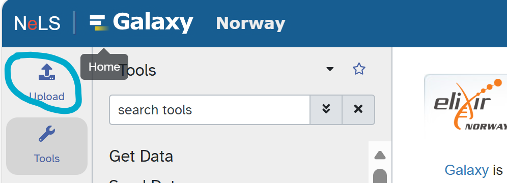
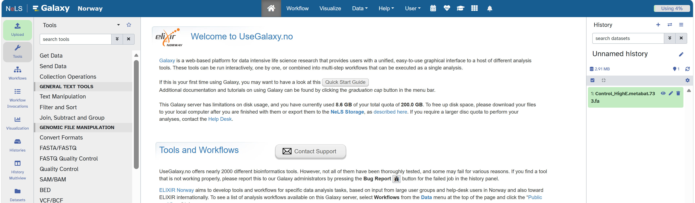
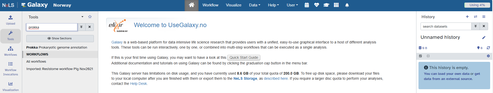
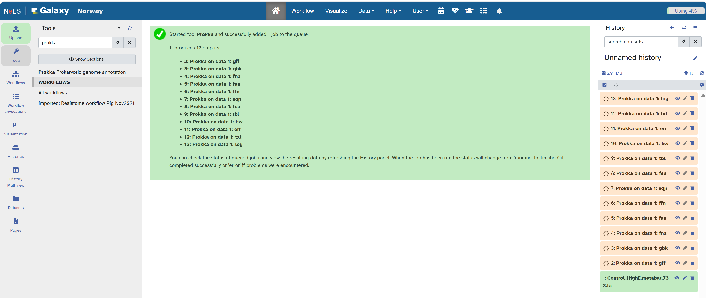
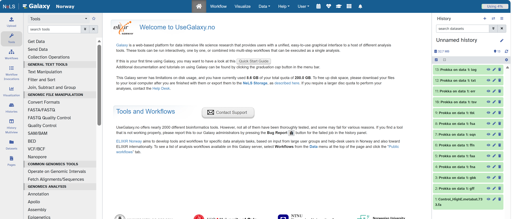
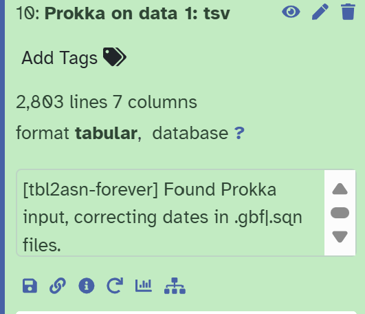

[← Home](../index.md)

# HFX307/407 Metagenomic Computer Lab

## Exercise A – Genome annotation in bacteria and archaea – genomes and MAGs

[Prokka](https://github.com/tseemann/prokka) is a rapid genome annotation pipeline designed for bacterial and archaeal genomes. It identifies genomic features such as protein-coding sequences (CDSs), rRNAs and tRNAs, and assigns putative functions to predicted genes by comparing them against reference databases. Prokka can also be applied to metagenome-assembled genomes (MAGs), producing standard output files containing gene coordinates, nucleotide sequences and predicted protein sequences.

In this exercise, Prokka will be used to annotate the MAG and generate the predicted protein sequences that will be used for downstream functional analyses.


1. The first we need a fasta file, let's download the file from [here](https://ns9864k.web.sigma2.no/TheMEMOLab/courses/hfx307_407/Genome/)
    - Do click on the ```Control_HighE.metabat.733.fa``` file an save link as. Save it to your PC.

2. We can use Galaxy, a web-based platform for data intensive life science research that provides users with a unified, easy-to-use graphical interface to a host of different analysis tools to launch Prokka and 
annotate our genome. Let's login to [Galaxy](https://usegalaxy.no/) using our Feide credentials. 

3. Upload the fasta file using the ```upload``` buttom as it is shown here 

4. Once uploaded you shoudl see it in your history: 


5. To launch Prokka we can look for it in the Tools search . 

6. Select the ```Control_HighE.metabat.733.fa``` file and press ```run Tool```. Jobs are submitted now:



Once completed all jobs will appear as green: 




Prokka producces different files:

| File | Contains |
|---|---|
| `.gff` | Genome annotation in GFF3 format, including the coordinates and annotation of predicted genes, CDSs, rRNAs, tRNAs and other features. |
| `.gbk` | GenBank-formatted annotated genome containing the DNA sequence together with all predicted genomic features and annotations. |
| `.faa` | Amino-acid sequences of all predicted protein-coding genes. This is the main file used for downstream protein-function analyses. |
| `.ffn` | Nucleotide sequences of all predicted genes and other annotated features. |
| `.fna` | Nucleotide sequence of the input contigs/genome. |
| `.tbl` | Feature table containing the locations and annotations of genomic features, mainly used for submission to sequence databases. |
| `.sqn` | Sequin-formatted file prepared for submission to GenBank/ENA-type repositories. |
| `.txt` | Short summary of the annotation, including the number of contigs, CDSs, rRNAs, tRNAs and other predicted features. |
| `.log` | Log file recording the Prokka run, parameters and processing steps. |

We can then use the .tbl file to extract the annotation. To save open the ```10. Prokka on data 1: tsv``` file and click on the disk button:



## Using Copilot to summarize the information of the Prokka annotation.

Use your NMBU account to login into [Microsoft-Copilot](https://copilot.com/). 

1. Upload the tsv file using the ```+``` button.

2. Once your file is up, lets use this prompt:

```copilot
Hi, use the annotation table attached from prokka. Let me know how many genes are from metabolism, anabolism and how many non-annotated or non known function genes are. Give me a table with this summary
```

What is the result?

3. We can check for CAZy genes by prompting:

```copilot
Check for carbohydrate active genes (CAZymes), give a summary table
```

4. Produce a plot with this information:

```copilot
using this information produce a barplot of the annotation genes. Give me the code to reproduce
```


### What other idea do you think we can look using this tools?


